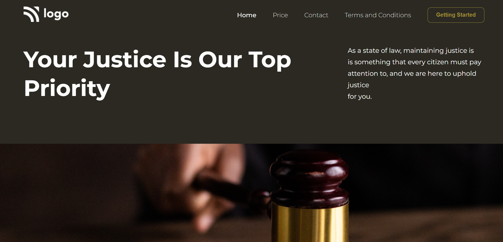

# Assigment-4

# **Project-4** [Live Link](https://ineuronproject-4.netlify.app/)
>- Skills gained in this project
 >- I learned about how to use poisition in css [Relative and absolute]
 >- learned about how to use css selectors like:nth-child() :last-child, first child and  i also learned about overflow property, transparent property and object fit property
 
 ***
 **Time taken to finish to this project**
 
 >-It took me 2 hour to complete this project 

 **Screenshot**
 
 